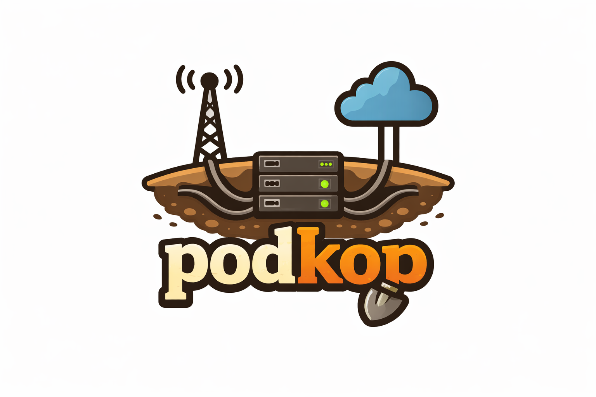

# Podkop Webhook Relay



Can be useful for local development if you don't have possibility to proxy webhooks directly to your local machine.

The main idea is to put the server application anywhere available over internet and then poll requests by the client application run locally.

Three services: one receives webhooks and buffers them, second forwards them to your application, and third is for the test. You can imagine that the server caches the webhooks and plays a queue role for the clients.

```
External Service
      │  POST /{name}  (optional Basic Auth)
      ▼
   [server]  ──── SQLite (./data/webhooks.db)
      │  POST /api/poll  { secret_key }
      ▼
   [client]  reads client/webhooks.json
      │  POST to each configured forward_url
      ▼
   your app(s)
```

## Services

| Service | Role |
|---------|------|
| **server** | Receives webhooks, stores them in SQLite, exposes a polling API |
| **client** | Polls the server for each configured webhook, forwards to its own URL, sends ACK on success |
| **target** | Demo destination that logs received webhooks (replace with your app) |

## Quick Start

```bash
# 1. Edit .env — set SERVER_PORT, ADMIN_SECRET

# 2. Start everything
docker-compose up --build -d

# 3. Create a webhook endpoint
docker-compose exec server node src/cli.js create-webhook mywebhook
```

Output:
```
Webhook "mywebhook" created.
  URL        : http://localhost:3033/mywebhook
  Secret key : a3f9c2d1e8b5...
  Auth       : none
```

```bash
# 4. Add the secret key to client/webhooks.json, then apply changes
docker-compose up -d client
```

## Managing Webhook Endpoints

```bash
# Create — open endpoint (anyone can POST to it)
docker-compose exec server node src/cli.js create-webhook <name>

# Create — protected endpoint (requires Basic Auth on incoming webhooks)
docker-compose exec server node src/cli.js create-webhook <name> <username> <password>

# Update credentials on an existing endpoint
docker-compose exec server node src/cli.js set-credentials <name> <username> <password>

# Remove Basic Auth from an endpoint (make it open)
docker-compose exec server node src/cli.js disable-auth <name>

# Delete all buffered (pending) webhooks for an endpoint without removing the endpoint itself
docker-compose exec server node src/cli.js purge-webhooks <name>

# List all endpoints with their secret keys
docker-compose exec server node src/cli.js list-webhooks

# Show pending and delivered webhook counts per endpoint
docker-compose exec server node src/cli.js stats

# Delete an endpoint (also deletes all its buffered webhooks)
docker-compose exec server node src/cli.js delete-webhook <name>
```

- Name may only contain letters, digits, `-` and `_`
- Reserved names: `api`, `admin`, `health`
- Each endpoint gets a unique `secret_key` used for polling

## Configuring the Client (`client/webhooks.json`)

Each entry in the array defines one webhook to poll and where to forward it:

```json
[
  {
    "secret_key": "a3f9c2d1...",
    "forward_url": "http://myapp:8080/hooks/payments"
  },
  {
    "secret_key": "b7e1f4a2...",
    "forward_url": "http://otherapp:9090/events"
  }
]
```

### Header forwarding

The client replays all original request headers to the target (minus HTTP hop-by-hop headers such as `host`, `content-length`, `transfer-encoding`, etc.). One metadata header is always added:

| Header | Value |
|--------|-------|
| `X-Original-Method` | HTTP method of the original webhook request |

### Filtering and adding headers

Two optional per-entry fields let you control which headers reach your target:

**`strip_headers`** — remove headers from the original request before forwarding (case-insensitive):

```json
{
  "secret_key": "...",
  "forward_url": "http://myapp:8080/hooks",
  "strip_headers": ["authorization", "x-hub-signature"]
}
```

**`add_headers`** — add or override headers when forwarding (applied after `strip_headers`):

```json
{
  "secret_key": "...",
  "forward_url": "http://myapp:8080/hooks",
  "add_headers": {
    "Authorization": "Bearer my-internal-token",
    "X-Forwarded-By": "podkop"
  }
}
```

Both fields are optional and can be combined in the same entry.

### Giving up after repeated failures

By default, if the client cannot forward a webhook to the target (non-2xx response or network error), the webhook stays on the server and is retried every poll cycle — indefinitely.

Enable with `CLIENT_GIVE_UP_ENABLED=true` and set `CLIENT_MAX_DELIVERY_ATTEMPTS` to the number of consecutive failures allowed. Once a webhook reaches the limit, the client ACKs it (removing it from the server queue) and logs a warning. Failure counters are kept in memory and reset on container restart.

```
CLIENT_GIVE_UP_ENABLED=true
CLIENT_MAX_DELIVERY_ATTEMPTS=5   # give up after 5 failed attempts
```

> **Note:** `client/webhooks.json` contains secret keys — keep it out of version control and never bake it into a Docker image. The client Dockerfile copies only `src/` and `package.json`; the file is mounted at runtime via `docker-compose.yml`.

After editing the file, apply changes:

```bash
docker-compose up -d client
```

## Sending a Webhook

```bash
# Open endpoint
curl -X POST http://localhost:3033/mywebhook \
  -H "Content-Type: application/json" \
  -d '{"event": "order.paid", "id": 42}'

# Protected endpoint
curl -u alice:secret123 -X POST http://localhost:3033/secured \
  -H "Content-Type: application/json" \
  -d '{"event": "order.paid", "id": 42}'
```

Requests to unknown endpoint names return `404`.
Requests to protected endpoints without valid credentials return `401`.
Requests that exceed the rate limit return `429`.

## Polling API (used by client internally)

**Get webhooks (batched):**
```
POST /api/poll
{ "secret_key": "<key>" }
```

**Acknowledge delivery (deletes from server):**
```
POST /api/ack
{ "secret_key": "<key>", "ids": [1, 2, 3] }
```

Webhooks are deleted only after a successful ACK. If the client fails to forward a webhook, it stays on the server and is retried on the next poll cycle.

The number of IDs per ACK request is capped by `ACK_MAX_IDS` (default: 10).

## Key Configuration (.env)

| Variable | Default | Description |
|----------|---------|-------------|
| `SERVER_PORT` | `3000` | Server HTTP port |
| `DB_PATH` | `/data/webhooks.db` | SQLite file path inside container |
| `ADMIN_SECRET` | — | Protects admin endpoints — **change this** |
| `SERVER_DEBUG` | `false` | Verbose logging: full request headers, body, returned/acked IDs |
| `POLL_BATCH_SIZE` | `10` | Webhooks returned per poll request |
| `ACK_MAX_IDS` | `10` | Maximum IDs allowed in a single ACK request |
| `WEBHOOK_BODY_LIMIT` | `2mb` | Maximum request body size accepted by the webhook receiver |
| `WEBHOOK_RATE_LIMIT_RPM` | `60` | Max incoming requests per minute per endpoint name (0 = disabled) |
| `CLEANUP_INTERVAL_MINUTES` | `5` | How often the cleanup job runs |
| `WEBHOOK_MAX_AGE_MINUTES` | `60` | Delete undelivered webhooks older than this |
| `CLI_SERVER_URL` | `http://localhost:{SERVER_PORT}` | Server URL used by the CLI (inside container) |
| `CLIENT_SERVER_URL` | `http://server:{SERVER_PORT}` | Server URL as seen from the client container |
| `CLIENT_WEBHOOKS_CONFIG` | `/app/webhooks.json` | Path to the client config file inside container |
| `CLIENT_POLL_INTERVAL_SECONDS` | `10` | How often the client polls (applies to all entries) |
| `CLIENT_IGNORE_TLS_ERRORS` | `false` | Set to `true` to skip TLS certificate validation when forwarding to HTTPS targets (e.g. self-signed certs). **Use only in development.** |
| `CLIENT_DEBUG` | `false` | Verbose logging: full webhook payloads, forward response bodies, acked IDs |
| `CLIENT_GIVE_UP_ENABLED` | `false` | Enable give-up on repeated forward failures. When `true`, webhooks that fail `CLIENT_MAX_DELIVERY_ATTEMPTS` times in a row are ACK-ed and removed from the server queue. |
| `CLIENT_MAX_DELIVERY_ATTEMPTS` | `3` | Consecutive forward failures before a webhook is given up. Only used when `CLIENT_GIVE_UP_ENABLED=true`. `0` = disabled. |
| `MULTI_CLIENT_ENABLED` | `false` | Allow multiple clients to receive the same webhook |
| `MAX_DELIVERIES_PER_WEBHOOK` | `1` | How many clients must ACK a webhook before it is deleted (only when `MULTI_CLIENT_ENABLED=true`) |

## Replacing the Target

Remove the `target` service from `docker-compose.yml` and point `forward_url` in `client/webhooks.json` directly at your app:

```json
[{ "secret_key": "...", "forward_url": "http://myapp.internal:8080/webhooks" }]
```
